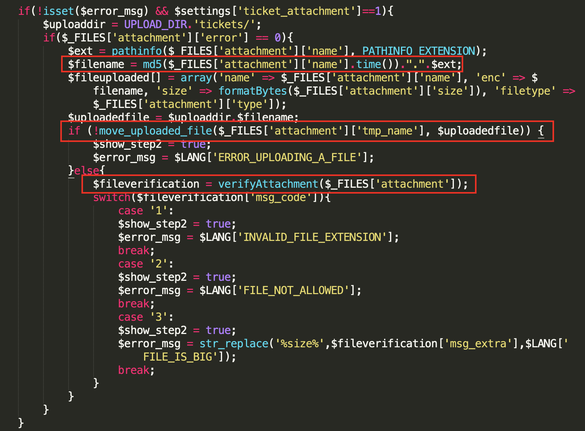

## HelpDeskZ 1.0.2 - Arbitrary File Upload

https://github.com/evolutionscript/HelpDeskZ-1.0

https://www.exploit-db.com/exploits/40300

### Root causes

#### 1/ Store untrusted file before validation

The backend controller first stores the user's uploaded file to '/uploads/tickets/' folder, then proceed to validate it.

In 'controllers/submit_ticket_controller.php':




#### 2/ Wrong assumption on apache configuration

The application supposes that apache uses `AllowOverride: All` in its configuration, thus it uses `.htaccess` to deny any access to '/uploads/*'. But after apache 2.3.9+, by default, `AllowOverride` is set to `None`.


#### 3/ Weak algorithm in file renaming

Using current time as salt in this case is not enough to protected from brute-force attack.

```
md5( filename + time() ) + '.' + file_extention
```
