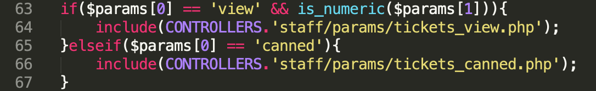
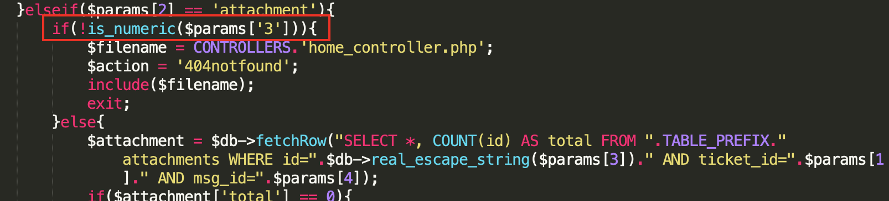

## SQL Injection

https://www.exploit-db.com/exploits/41200

### Injection point

`$param[4]` (msg_id) in the following request (to download the attachment) is vulnerable to SQL injection:


```
GET /support/?v=staff&action=tickets&param[]=view&param[]=2&param[]=attachment&param[]=2&param[]=1+1
```
```
param[0] -> view
param[1] -> ticket_id
param[2] -> attachment
param[3] -> attachment_id
param[4] -> msg_id
```

With valid SQL parameters in request, server returns 200 and attachment data.

With invalid SQL parameters in request, server returns 200 and an error image.

### Root cause

=> **No validation for SQL integer parameter**

`param[1]` (ticket_id) is passed integer check in '/controllers/staff/tickets_action.php':



`param[3]` (attachment_id) is passed integer check in '/controllers/staff/params/tickets_view.php':




Note:

In PHP 4 >= 4.3.0, PHP 5, `real_escape_string()` can **NOT** be used to prevent SQLi when the parameter is integer, as it only deals with string:

> mysql_real_escape_string() calls MySQL's library function mysql_real_escape_string, which prepends backslashes to the following characters: \x00, \n, \r, \, ', " and \x1a.

> https://www.php.net/manual/en/function.mysql-real-escape-string.php


